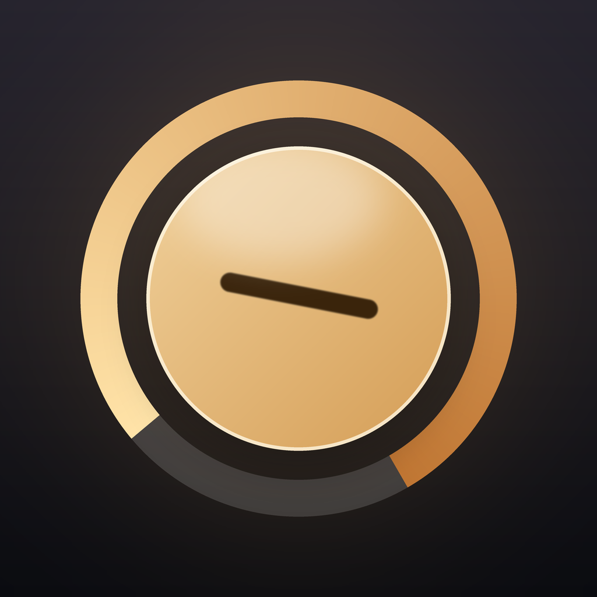

# Копилка — приложение для накоплений (iOS)

Нативное iOS-приложение для целевых накоплений: цели, пополнения, прогресс и статистика.
Премиальный интерфейс на SwiftUI, полностью офлайн, без регистрации, рекламы и аналитики.

<p>
  
</p>

## Что умеет

- **Цели.** Название, сумма, срок, иконка и цвет. Для каждой цели — своё кольцо прогресса.
- **Пополнения и снятия.** Отдельный экран ввода с собственной клавиатурой, быстрыми суммами
  («+500», «+1 000», «До цели») и комментарием к операции.
- **Прогресс.** Кольцо с коническим градиентом, вехи 25/50/75/100 %, нужный темп в неделю,
  предупреждение о просроченном сроке.
- **Статистика.** Сводные плитки, столбчатый график пополнений по месяцам с выбором столбца,
  распределение накоплений по целям, серия недель подряд с пополнением.
- **Празднование.** При закрытии цели — конфетти и тактильный отклик.
- **Настройки.** Светлая/тёмная/системная тема, десять валют, тактильный отклик,
  еженедельное локальное напоминание, архив целей и полный сброс.
- **Онбординг.** Три экрана с анимированными иллюстрациями и выбором валюты из десяти.

## Требования

- Xcode 16 или новее
- iOS 17.0+
- Swift 5.9+

## Как запустить

```bash
open Kopilka.xcodeproj
```

Выберите схему **Kopilka**, симулятор iPhone 15 Pro (или новее) и нажмите ⌘R.
Внешних зависимостей нет — Swift Package Manager и CocoaPods не используются.

## Структура проекта

```
Kopilka/
├── App/           # Точка входа, вкладки, оформление системных панелей
├── Design/        # Дизайн-система: палитра, типографика, компоненты
│   └── Components/  AuroraBackground, ProgressRing, NumberPad, Confetti, кнопки, карточки
├── Models/        # Goal, Transaction, Money, CurrencyOption, AppSettings
├── Services/      # SavingsStore (@Observable), хранилище на диске, аналитика, хаптика, напоминания
├── Features/      # Экраны: Home, GoalDetail, Editor, Money, Stats, Settings, Onboarding
└── Resources/     # Assets.xcassets, PrivacyInfo.xcprivacy
```

## Архитектура

- **Единый источник правды.** `SavingsStore` — класс с макросом `@Observable`, который отдаётся
  вниз по иерархии через `.environment(...)`. Экраны не хранят копий данных.
- **Хранение.** Всё состояние (цели + настройки) сериализуется в один JSON-файл в
  `Application Support/Kopilka/state.json`. Запись атомарная и в фоновой очереди;
  повреждённый файл автоматически отводится в сторону, чтобы приложение всё равно запустилось.
- **Деньги.** `Money` — псевдоним `Decimal`, форматирование и округление собраны в одном месте.
- **Дизайн-система.** Ни один экран не задаёт цвет напрямую: только токены из `Theme`
  и градиенты палитр целей — поэтому тёмная тема работает везде одинаково.

## Дизайн

- Тёплая золотая палитра, скруглённая гарнитура SF Rounded, карточки с мягкими тенями.
- Фон `AuroraBackground` — медленно плывущие световые пятна, свои для каждого раздела.
- Все анимации уважают «Уменьшение движения» (`accessibilityReduceMotion`).
- Динамический шрифт, `minimumScaleFactor` на суммах, метки VoiceOver на графике и кольцах.

## Иконка

Иконка генерируется скриптом (Pillow), чтобы её можно было воспроизвести и поправить:

```bash
pip install Pillow
python3 Tools/generate_app_icon.py
```

## Веб-версия и деплой на Vercel

В папке [`web/`](web/) лежит веб-версия приложения: тот же продукт, что и в iOS,
на чистых HTML, CSS и JS без зависимостей и сборки. Главная страница — само приложение.

Первый запуск начинается с выбора валюты (подсказывается по языку браузера),
дальше — чистый экран: целей нет, демо-данные не подставляются.
Всё, что он создаст, хранится в `localStorage` его браузера; кнопка
«Удалить все данные» в настройках возвращает приложение к исходному виду.

Локальный просмотр:

```bash
cd web && python3 -m http.server 8099   # затем http://localhost:8099/
```

Деплой из терминала (из корня репозитория):

```bash
npx vercel@latest login
npx vercel@latest --prod
```

Либо через интерфейс Vercel: **New Project → Import** репозиторий → **Framework Preset: Other** → Deploy.
Конфигурация уже в репозитории: корневой `vercel.json` отдаёт папку `web` как статический сайт
(если в настройках проекта задать **Root Directory = web**, применится `web/vercel.json` — оба варианта рабочие).

Важно: Vercel хостит только веб. Нативное iOS-приложение туда не выкладывается —
оно собирается в Xcode и уходит в App Store отдельно.

## Публикация в App Store

Материалы для App Store Connect — в папке [`AppStore/`](AppStore/):

- `metadata-ru.md` — название, подзаголовок, описание, ключевые слова, «Что нового»;
- `metadata-en.md` — то же на английском;
- `privacy.md` — ответы для анкеты App Privacy и текст политики конфиденциальности;
- `release-checklist.md` — пошаговый чек-лист выпуска и план скриншотов.

Перед архивированием задайте свои `DEVELOPMENT_TEAM` и `PRODUCT_BUNDLE_IDENTIFIER`
(сейчас `com.qquebak.kopilka`) в настройках таргета.
